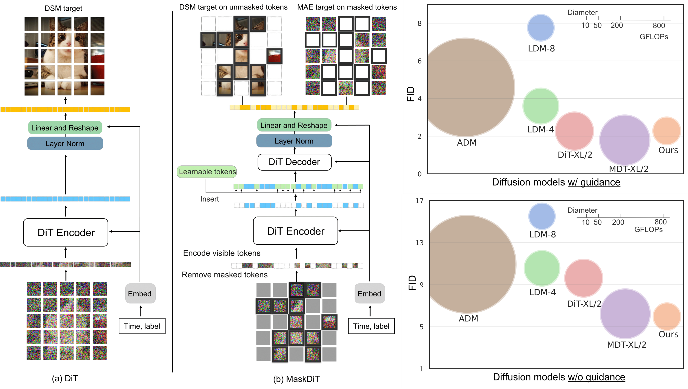
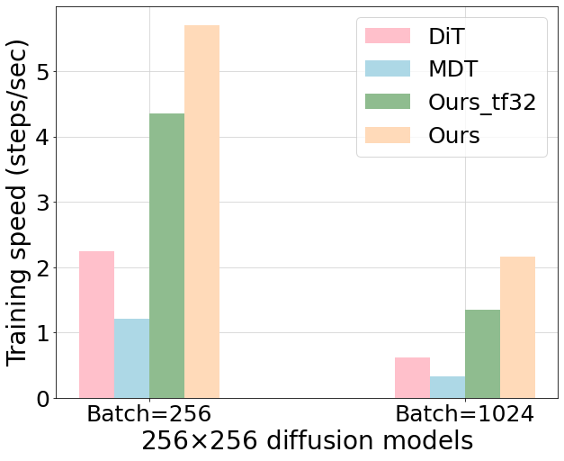
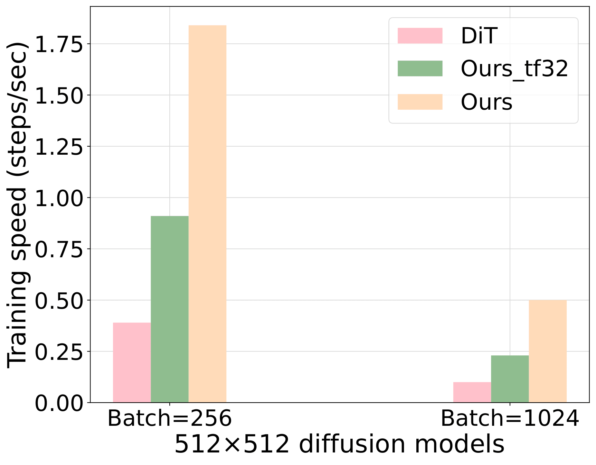
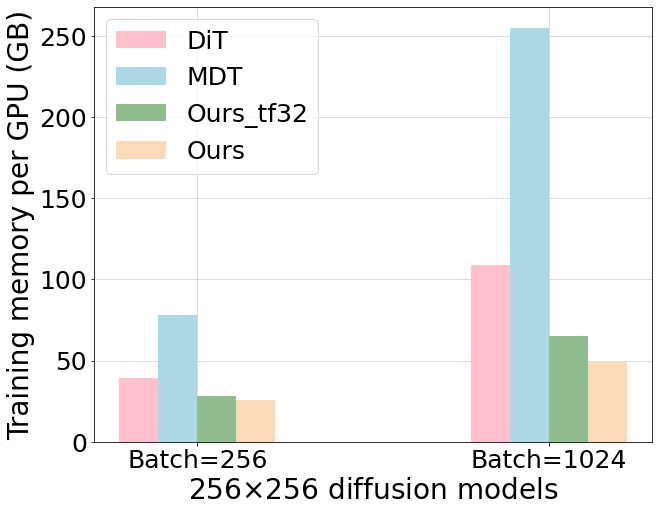
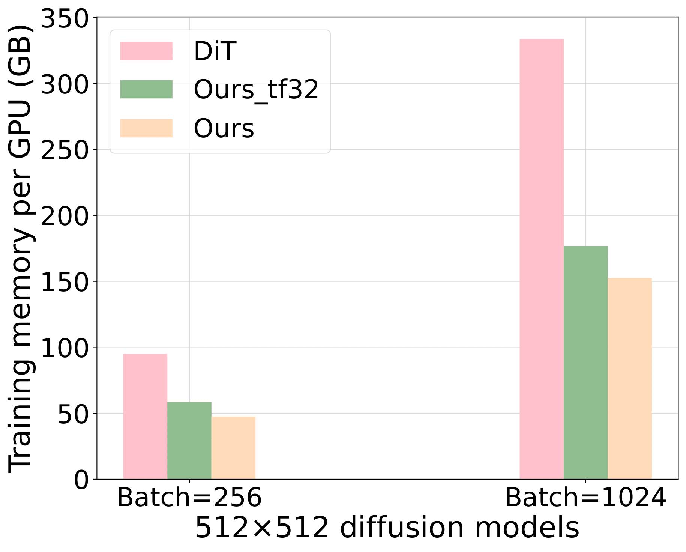
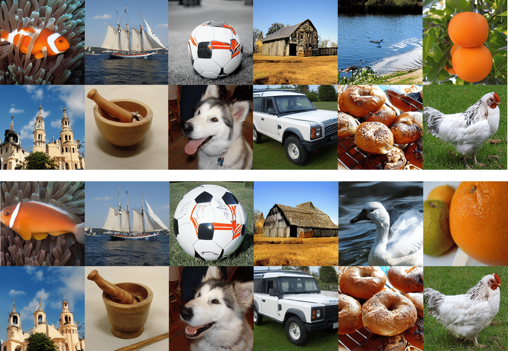

# Fast Training of Diffusion Models with Masked Transformers

Official PyTorch implementation of the TMLR 2024 paper:<br>
**[Fast Training of Diffusion Models with Masked Transformers](https://openreview.net/pdf?id=vTBjBtGioE)**
<br>
Hongkai Zheng*, Weili Nie*, Arash Vahdat, Anima Anandkumar <br>
(*Equal contribution)<br>

Abstract: *While masked transformers have been extensively explored for representation learning, their application to
generative learning is less explored in the vision domain. Our work is the first to exploit masked training to reduce
the training cost of diffusion models significantly. Specifically, we randomly mask out a high proportion (e.g., 50%) of
patches in diffused input images during training. For masked training, we introduce an asymmetric encoder-decoder
architecture consisting of a transformer encoder that operates only on unmasked patches and a lightweight transformer
decoder on full patches. To promote a long-range understanding of full patches, we add an auxiliary task of
reconstructing masked patches to the denoising score matching objective that learns the score of unmasked patches.
Experiments on ImageNet-256x256 and ImageNet-512x512 show that our approach achieves competitive and even better
generative performance than the state-of-the-art Diffusion Transformer (DiT) model, using only around 30% of its
original training time. Thus, our method shows a promising way of efficiently training large transformer-based diffusion
models without sacrificing the generative performance.*

<div align='center'>

</div>

## Requirements

- Training MaskDiT on ImageNet256x256 takes around 260 hours with 8 A100 GPUs to perform 2M updates with a batch size of
  1024.
- Training MaskDiT on ImageNet512x512 takes around 210 A100 GPU days to perform 1M updates with a batch size of 1024.
- At least one high-end GPU for sampling.
- [Dockerfile](Dockerfile) is provided for exact software environment.

## Efficiency

Our MaskDiT applies Automatic Mixed Precision (AMP) by default. We also add the MaskDiT without AMP (Ours_ft32) for
reference.

### Training speed



### GPU memory



## Pretrained Models
We provide pretrained models of MaskDiT for ImageNet256 and ImageNet512 in the following table. For FID with guidance, the guidance scale is set to 1.5 by default.
| Guidance | Resolution | FID   | Model                                                                                                                     |
| :------- | :--------- | :---- | :------------------------------------------------------------------------------------------------------------------------ |
| Yes      | 256x256    | 2.28  | [imagenet256-guidance.pt](https://slurm-ord.s3.amazonaws.com/ckpts/256/imagenet256-ckpt-best_with_guidance.pt)       |
| No       | 256x256    | 5.69  | [imagenet256-conditional.pt](https://slurm-ord.s3.amazonaws.com/ckpts/256/imagenet256-ckpt-best_without_guidance.pt) |
| Yes      | 512x512    | 2.50  | [imagenet512-guidance.pt](https://slurm-ord.s3.amazonaws.com/ckpts/512/1080000.pt)                            `       |
| No       | 512x512    | 10.79 | [imagenet512-conditional.pt](https://slurm-ord.s3.amazonaws.com/ckpts/512/1050000.pt)                                 |                                                                                       |

## Generate from pretrained models

To generate samples from provided checkpoints, run

```bash
python3 generate.py --config configs/test/maskdit-512.yaml --ckpt_path [path to checkpoints] --class_idx [class index from 0-999] --cfg_scale [guidance scale]
```


<p align='center'> Generated samples from MaskDiT 256x256. Upper panel: without CFG. Lower panel: with CFG (scale=1.5).
<p\>


<p align='center'> Generated samples from MaskDiT 512x512 with CFG (scale=1.5).
<p\>

## Prepare dataset

We use the pre-trained VAE to first encode the ImageNet dataset into latent space. You can download the ImageNet-256x256
and ImageNet-512x512 that have been encoded into latent space by running

```bash
bash scripts/download_assets.sh
```

`extract_latent.py` was used to encode the ImageNet.

### LMDB to Webdataset

When training on ImageNet-256x256, we store our data in LMDB format. When training on ImageNet-512x512, we
use [webdataset](https://github.com/webdataset/webdataset) for faster IO performance. To convert a LMDB dataset into a
webdataset, run

```
python3 lmdb2wds.py --datadir [path to lmdb] --outdir [path to save webdataset] --resolution [latent resolution] --num_channels [number of latent channels]
```

## Train

### ImageNet-256x256

First train MaskDiT with 50% mask ratio with AMP enabled.

```bash
accelerate launch --multi_gpu train.py --config configs/train/imagenet256-latent.yaml
```

Then finetune with unmasking.

```bash
accelerate launch --multi_gpu train.py --config configs/finetune/imagenet256-latent-const.yaml --ckpt_path [path to checkpoint] --use_ckpt_path False --use_strict_load False --no_amp
```

### ImageNet-512x512

Train MaskDiT with 50% mask ratio with AMP enabled. Here is an example of 4-node training script.

```bash
bash scripts/train_latent512.sh
```

Then finetune with unmasking.

```bash
bash scripts/finetune_latent512.sh
```

## Evaluation

### FID evaluation

To compute a FID of a pretrained model, run

```bash
accelerate launch --multi_gpu eval_latent.py --config configs/test/maskdit-256.yaml --ckpt [path to the pretrained model] --cfg_scale [guidance scale]
```

### Full evaluation

First, download the reference from [ADM repo](https://github.com/openai/guided-diffusion/tree/main/evaluations)
directly. You can also use `download_assets.py` by running

```bash
python3 download_assets.py --name imagenet256 --dest [destination directory]
```

Then we use the evaluator `evaluator.py`
from [ADM repo](https://github.com/openai/guided-diffusion/tree/main/evaluations), or `fid.py`
from [EDM repo](https://github.com/NVlabs/edm), to evaluate the generated samples.

## Acknowledgements

Thanks to the open source codebases such as [DiT](https://github.com/facebookresearch/DiT)
, [MAE](https://github.com/facebookresearch/mae), [U-ViT](https://github.com/baofff/U-ViT)
, [ADM](https://github.com/openai/guided-diffusion), and [EDM](https://github.com/NVlabs/edm). Our codebase is built on
them. 
