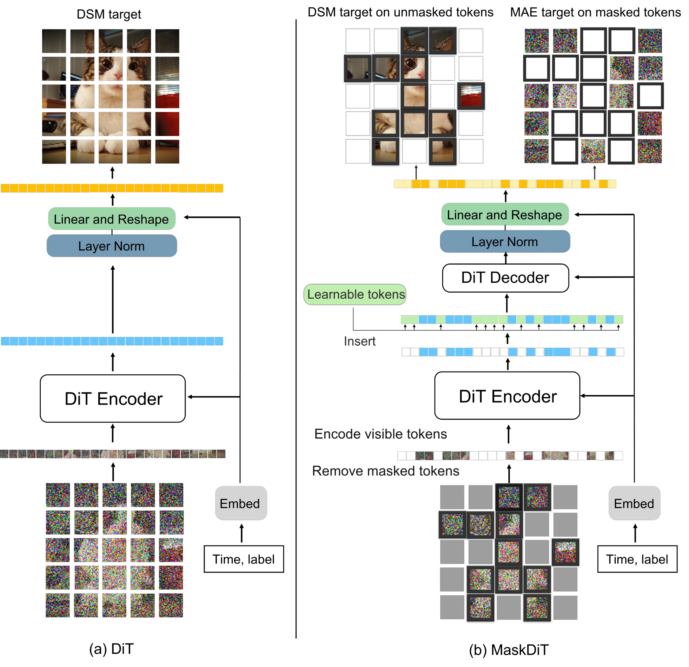
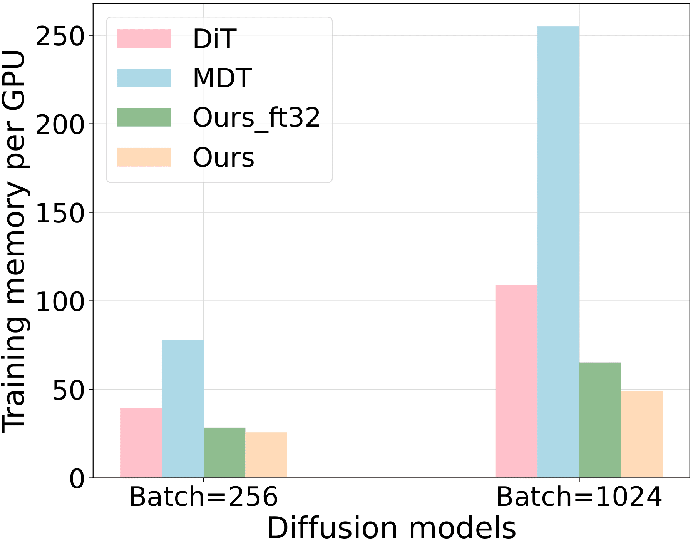
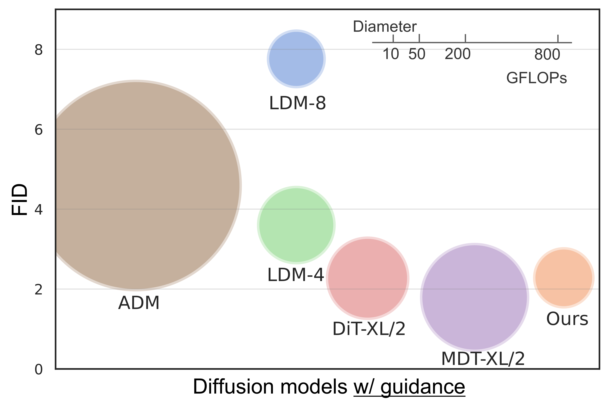
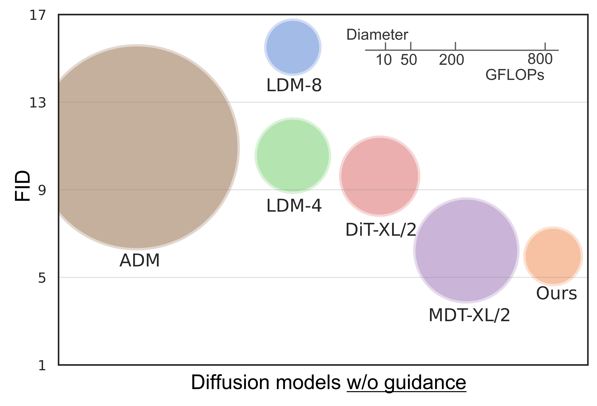

# Fast Training of Diffusion Models with Masked Transformers
Official implementation of the paper "Fast Training of Diffusion Models with Masked Transformers"
> Abstract: _We propose an efficient approach to train large diffusion models  with masked transformers.
While masked transformers have been extensively explored for representation learning, their application to generative learning is less explored in the vision domain. Our work is the first to exploit masked training to reduce the training cost of diffusion models significantly. Specifically, we randomly mask out a high proportion (e.g., 50%) of patches in diffused input images during training. For masked training, we introduce an asymmetric encoder-decoder architecture consisting of a transformer encoder that operates only on unmasked patches and a lightweight transformer decoder on full patches. To promote a long-range understanding of full patches, we add an auxiliary task of reconstructing masked patches to the denoising score matching objective that learns the score of unmasked patches. Experiments on ImageNet-256x256 show that our approach achieves the same performance as the state-of-the-art Diffusion Transformer (DiT) model, using only 31% of its original training time.  Thus, our method allows for efficient training of diffusion models without sacrificing the generative performance._

<div align='center'>

</div>


## Training efficiency
Our MaskDiT applies Automatic Mixed Precision (AMP) by default. We also add the MaskDiT without AMP (Ours_ft32) for reference. 




## Requirements
- We ran our training of MaskDiT on 8 A100 GPUs for around 270 hours. 
- At least one high-end GPU for sampling. 
- [Dockerfile](Dockerfile) is provided for exact software environment. 

## Prepare dataset
We use the pre-trained VAE to first encode the ImageNet dataset into latent space. You can download the pre-trained VAE by using `download_assets.py`. 
```
python3 download_assets.py --name vae --dest assets
```
You can also directly download the dataset we have prepared by running
```
python3 download_assets.py --name imagenet-latent-data --dest [destination directory]
```

## Train
We first train MaskDiT with 50% mask ratio with AMP enabled. 
```bash
python3 train_latent.py --config configs/train/maskdit-latent-imagenet.yaml --num_process_per_node 8
```
We then finetune with unmasking. For example, 
```bash
python3 train_latent.py --config configs/finetune/maskdit-latent-imagenet-const.yaml --ckpt_path [path to checkpoint] --use_ckpt_path False --use_strict_load False --no_amp
```

<details><summary>Train on the original ImageNet. Click to expand. </summary>
  
  We also provide code for training MaskDiT without pre-encoded dataset in `train.py`. This is only for reference. We did not fully test it. After preparing the original [ImageNet dataset](https://image-net.org/download.php), run 
  ```bash
  python3 train.py --config configs/train/maskdit-imagenet.yaml --num_process_per_node 8
  ```
</details>


## Generate samples
To generate samples from provided checkpoints, for example, run
```bash
python3 generate.py --config configs/test/maskdit-latent-base.yaml --ckpt_path results/2075000.pt --class_idx 388 --cfg_scale 2.5
```

Checkpoints of MaskDiT can be downloaded by running `download_assets.py`. For example, 
```bash
python3 download_assets.py --name maskdit-finetune0 --dest results
```
We provide the following checkpoints. 
- Checkpoint with best FID 5.69 without guidance: [imagenet256-ckpt-best_without_guidance.pt](https://maskdit-bucket.s3.us-west-2.amazonaws.com/cos-2037500.pthttps://maskdit-bucket.s3.us-west-2.amazonaws.com/imagenet256-ckpt-best_without_guidance.pt)
- Checkpoint with best FID 2.28 with guidance: [imagenet256-ckpt-best_with_guidance.pt](https://maskdit-bucket.s3.us-west-2.amazonaws.com/2075000.pthttps://maskdit-bucket.s3.us-west-2.amazonaws.com/imagenet256-ckpt-best_with_guidance.pt)


<p align='center'> Generated samples from MaskDiT. Upper panel: without CFG. Lower panel: with CFG (scale=1.5).
<p\>

## Evaluation
First, download the reference from [ADM repo](https://github.com/openai/guided-diffusion/tree/main/evaluations) directly. You can also use `download_assets.py` by running 
```bash
python3 download_assets.py --name imagenet256 --dest [destination directory]
```
Then we use the evaluator `evaluator.py` from [ADM repo](https://github.com/openai/guided-diffusion/tree/main/evaluations), or `fid.py` from [EDM repo](https://github.com/NVlabs/edm), to evaluate the generated samples.


<p align='center'> Generative performance on ImageNet-256x256. The area of each bubble indicates the FLOPs for a single forward pass during training. <p\>


## Citation


## Acknowledgements
Thanks to the open source codebases such as [DiT](https://github.com/facebookresearch/DiT), [MAE](https://github.com/facebookresearch/mae), [U-ViT](https://github.com/baofff/U-ViT), [ADM](https://github.com/openai/guided-diffusion), and [EDM](https://github.com/NVlabs/edm). Our codebase is built on them. 
